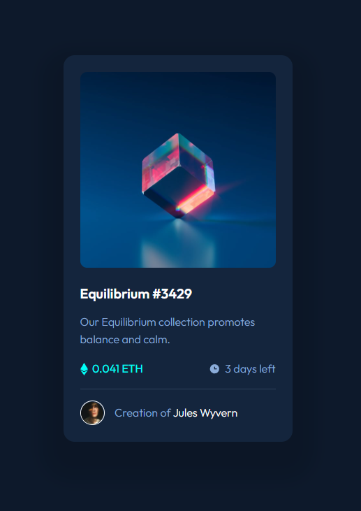

# Frontend Mentor - NFT preview card component solution

This is a solution to the [NFT preview card component challenge on Frontend Mentor](https://www.frontendmentor.io/challenges/nft-preview-card-component-SbdUL_w0U). Frontend Mentor challenges help you improve your coding skills by building realistic projects. 

## Table of contents

- [Overview](#overview)
  - [The challenge](#the-challenge)
  - [Screenshot](#screenshot)
  - [Links](#links)
- [My process](#my-process)
  - [Built with](#built-with)
  - [What I learned](#what-i-learned)
  - [Continued development](#continued-development)
  - [Useful resources](#useful-resources)
- [Author](#author)

## Overview

### The challenge

Users should be able to:

- View the optimal layout depending on their device's screen size
- See hover states for interactive elements

### Screenshot



### Links

- Solution URL: [GitHub](https://github.com/min4899/Frontend-Mentor-NFT-Preview-Card)
- Live Site URL: [GitHub Pages](https://min4899.github.io/Frontend-Mentor-NFT-Preview-Card-Component/)

## My process

### Built with

- Semantic HTML5 markup
- CSS custom properties
- Flexbox
- Mobile-first workflow

### What I learned

I learned how to place an overlay over elements using CSS positioning. A div element with transparent background is placed after the img element. Both the img element and overlay div element are under the same parent div element.

```html
<div class="image-section">
  
  <div class="image-overlay">
    
  </div>
</div>
```

The overlay div has absolute position. Since it's after the img element, it'll be placed over the img. 
The parent div must have relative position, or the child element with absolute position will be positioned relative to the next nearest positioned ancestor (in this case, the body).

```css
.image-section {
  border-radius: 0.6rem;
  width: fit-content;
  height: fit-content;
  overflow: hidden;
  display: grid;
  place-items: center;
  position: relative;
}

.image-section img {
  max-width: 100%;
}

.image-overlay {
  position: absolute;
  width: 100%;
  height: 100%;
  background-color: rgb(0, 255, 247, 45%);
  opacity: 0;
  display: grid;
  place-items: center;
}
```

### Continued development

I'd like to learn how to properly use CSS functions like that responsively resize elements (min, max, clamp). I've been messing around with clamp, but I still can't make it work properly.
I'd also like to learn when to use certain CSS units. I've been using mostly rem so far, but I feel like I should be using units like % or vw more often.

### Useful resources

- [How To Create an Overlay Image Title - W3Schools](https://www.w3schools.com/howto/tryit.asp?filename=tryhow_css_image_overlay_title)
- [CSS Layout - The position Property - W3Schools](https://www.w3schools.com/css/css_positioning.asp)

## Author

- GitHub - [Minwoo Soh](https://github.com/min4899)
- Frontend Mentor - [@min4899](https://www.frontendmentor.io/profile/min4899)
